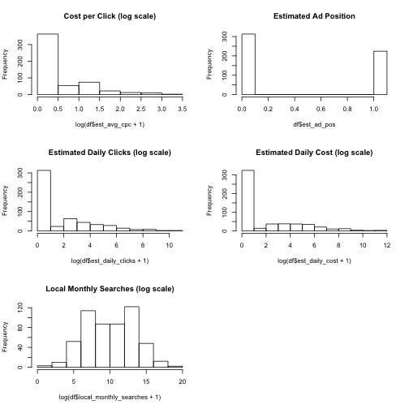

## Summary

Search engines allow advertisers to bid on keywords and groups of keywords. Some
of these search terms are more expensive than others. Some terms are submitted
more often than others.

What are the most cost-effective keywords on which to bid?

--- .class #id

## Advertising Keywords
 

--- .class #id

## Advertising Bidding Data
Notice the skewed distribution of continuous variables.

```r
summary( df[ , 2:length( df ) ] )
```

```
##  global_monthly_searches  est_avg_cpc      est_ad_pos    est_daily_clicks
##  Min.   :5.80e+01        Min.   : 0.00   Min.   :0.000   Min.   :    0   
##  1st Qu.:4.40e+03        1st Qu.: 0.00   1st Qu.:0.000   1st Qu.:    0   
##  Median :4.95e+04        Median : 0.00   Median :0.000   Median :    0   
##  Mean   :1.05e+07        Mean   : 1.26   Mean   :0.438   Mean   :  338   
##  3rd Qu.:1.00e+06        3rd Qu.: 1.21   3rd Qu.:1.050   3rd Qu.:   22   
##  Max.   :3.76e+09        Max.   :27.19   Max.   :1.060   Max.   :52064   
##  est_daily_cost   local_monthly_searches
##  Min.   :     0   Min.   :0.00e+00      
##  1st Qu.:     0   1st Qu.:1.90e+03      
##  Median :     0   Median :2.22e+04      
##  Mean   :   912   Mean   :1.59e+06      
##  3rd Qu.:    38   3rd Qu.:3.68e+05      
##  Max.   :137734   Max.   :3.38e+08
```

--- .class #id 

## Distributions Illustrated

 

--- .class #id 

## Conclusion

Because the search frequencies do not follow the same distribution as cost there
may be undervalued search terms. This application will help identify those
segments.

https://macasaet.shinyapps.io/developing-data-products_pitch/
